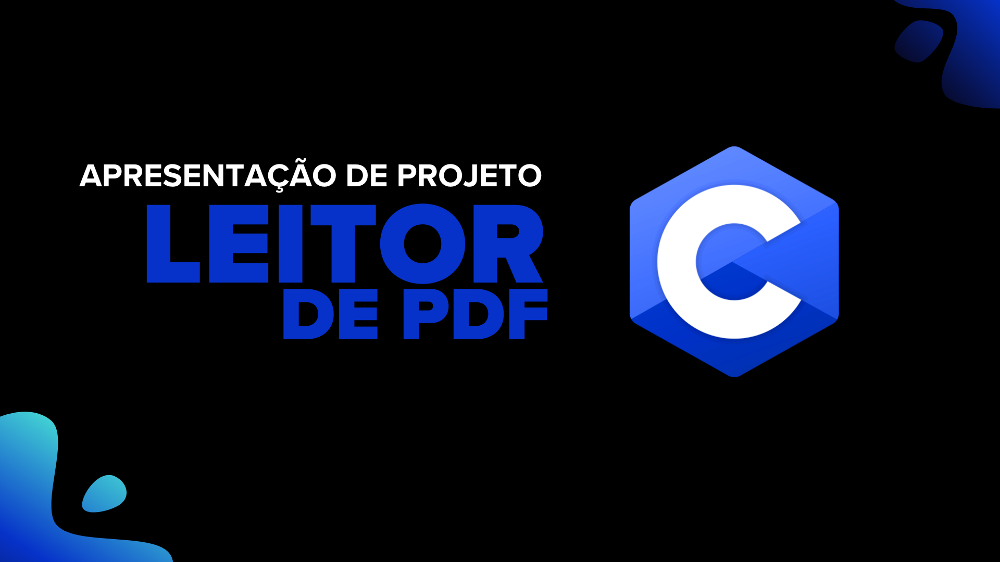

# PDF Scanner - Buscador de Palavras-Chave em Arquivos PDF

Este é um projeto simples de scanner de PDF desenvolvido em C, com foco na busca por palavras-chave dentro de arquivos de texto relacionados a arquivos PDF.

## 📌 O que o programa faz?

O programa faz o seguinte:

- **Pede ao usuário um caminho de pasta** onde estão os arquivos `.txt` (extraídos de PDFs ou não).
- **Gera uma lista de arquivos `.txt` e `.pdf`** presentes na pasta.
- **Solicita ao usuário uma palavra-chave** para busca.
- **Abre e escaneia os arquivos `.txt`**, contando quantas vezes a palavra aparece em cada um.
- **Ordena os resultados por número de ocorrências** (ordem crescente).
- **Exibe os nomes dos PDFs relacionados** a cada `.txt` e a quantidade de ocorrências encontradas.
- **Apresenta um resumo final** informando em quantos arquivos a palavra foi localizada.

## 🎤 Apresentação (HTML Slide)

[👉 Slides de Apresentação](https://ramomsouza07.github.io/scannerpdf/slides.html)
